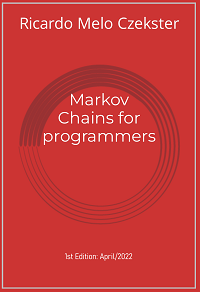

# Book: "Markov Chains for programmers"

This book was published by Self Publishers Worldwide (another publication by the _lazy panda_ collection), and authored by Ricardo M. Czekster.

The first edition was made public in April/2022. 

"Markov Chains for programmers" is devoted to programmers at any level wanting to understand more about the underpinnings of Markov Chains (MC) and basic solution methods.

You will find here supporting materials for the book such as MATLAB scripts, PRISM models (CTMC/DTMC), and MC models, which you may also [download here](MC-for-programmers2022.pdf).

This book is a companion to this [paper about Performance Evaluation](https://www.researchgate.net/publication/337623607_Introduction_to_Performance_Evaluation_of_Systems), published as a pre-print in [ResearchGate](https://www.researchgate.net/profile/Ricardo-Czekster).

## License
The book is under Creative Commons (CC BY 4.0) and the code is under GPLv3.

Feel free to use it and attribute the original source.

## Folders
The structure of the repository is as follows:

- `challenges`: proposed challenges throughout the book;
- `matlab`: MATLAB&reg; scripts for some solutions; 
- `models`: a list of DTMC and CTMC models (in the format that we explored in the book, with code);
- `prism`:  [PRISM](https://www.prismmodelchecker.org/) models (in CTMC and DTMC);
- `spreadsheets`: MS-Excel spreadsheets reproducing the experiments (CTMC/DTMC solution, simulation);

## Challenges
The book proposes a number of _challenges_ throughout its chapters. The code for all solutions are available for download here in this repository.

One remark: to avoid repetitions in the code, there is a folder called `project00` that has a `Makefile` and all the challenges (you may want to check the file `markov.c` to access auxiliary functions). In this project, each challenge has a `main()` function, so they work independently.

The `project01` folder contains a full project with one `main()` function and several built-in command-line options. Consult "Challenge 07" for more information about this project.

[Click here for more information about individual challenges](challenges.md)

## Models
The following models are available (they were named **S**N where N is the number of states):

- `S2-lighting-ctmc.txt`: The Lighting model, using rates;
- `S2-lighting-dtmc.txt`: The Lighting model, using probabilities;
- `S2-pushkin-dtmc.txt`: The pushkin model developed by A. A. Markov (according to Snell's book);
- `S3-land-of-oz-dtmc.txt`: The land of oz model;
- `S3-weather-belfast-dtmc.txt`: The Belfast weather model (by Stewart);
- `S4-aging-rejuvenation-ctmc`: Software aging and rejuvenation model, CTMC;
- `S4-aging-rejuvenation-dtmc`: Same (aging & rej), DTMC version;
- `S4-generic-ctmc.txt`: The Generic model;
- `S4-lilypad-ctmc.txt`: The Lily Pad model (frog in the pond);
- `S4-maze-model-dtmc.txt`: The Mouse Maze model;
- `S5-ehrenfest-dtmc.txt`: [The Ehrenfest model](https://en.wikipedia.org/wiki/Ehrenfest_model);
- `S6-birth-and-death-ctmc.txt`: A six state Birth and Death model;
- `S9-maze-model-dtmc.txt`: A larger Mouse Maze model, with 9 states;
- `S26-shakespeare-ctmc.txt`: A brief analysis of one of Shakespeare's Sonnets with MC;

You may try to run the challenges code for these models (beware that the type should match, either CTMC or DTMC).
[Click here for more information on models](models.md)

## Numerical methods, models and tools
The methods, models and tools explored in the book are Power Matrix, Vector-Matrix Multiplication, [PRISM](https://www.prismmodelchecker.org/) models, some MATLAB&reg; scripting, _forward_ simulation, and some MS-Excel spreadsheets (with basic models).

## How to cite the work
I thank you for your attribution, and for recognising the work.
To cite the book, please follow this suggestion:
- Czekster, Ricardo M. **"Markov Chains for programmers"**, Available at: https://github.com/czekster/markov. April, 2022.

## Author

Ricardo M. Czekster
rczekster at gmail

Ricardo is an active researcher in dependability and cyber-security.
Please, check out his virtual presence on the following platforms:
- [ORCID](https://orcid.org/0000-0002-6636-4398)
- [ResearchGate](https://www.researchgate.net/profile/Ricardo-Czekster)
- [DBLP](https://dblp.uni-trier.de/pers/hd/c/Czekster:Ricardo_M=)
- [Google Scholar profile](https://scholar.google.com.br/citations?user=M4SZcHsAAAAJ)
- [LinkedIn](https://www.linkedin.com/in/ricardoczekster/)
- [Publons](https://publons.com/researcher/1440444/ricardo-m-czekster/)
- [GitHub](https://github.com/czekster/)
