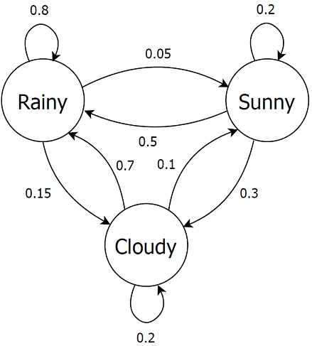

## Models

# S2-lighting-ctmc.txt
The Lighting model, a simple two state model to simulate a light switching on and off.

# S2-lighting-dtmc.txt
The Lighting model, using probabilities (DTMC version):

# S2-pushkin-dtmc.txt
The pushkin model developed by A. A. Markov (according to Snell's book).

# S3-land-of-oz-dtmc.txt
The land of oz model.

# S3-weather-belfast-dtmc.txt
The Belfast weather model (by Stewart).

# S4-generic-ctmc.txt
The Generic model.

# S4-lilypad-ctmc.txt
The Lily Pad model (frog in the pond).

# S4-aging-rejuvenation-ctmc.txt
Software Aging and Rejuvenation model (CTMC).

# S4-maze-model-dtmc.txt
The Mouse Maze model.

# S5-ehrenfest-dtmc.txt
The Ehrenfest model.

# S6-birth-and-death-ctmc.txt
A six state Birth and Death model.

# S9-maze-model-dtmc.txt
A larger Mouse Maze model, with 9 states.

# S26-shakespeare-ctmc.txt
Look at [spreadsheets/Chapter04-CTMC-26states-Shakespeare.xlsx](spreadsheets/Chapter04-CTMC-26states-Shakespeare.xlsx) for more information about this model.
