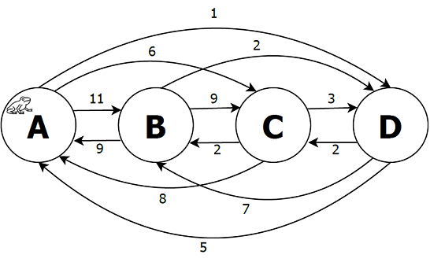

## CTMC Models

# S2-lighting-ctmc.txt
The Lighting model, a simple two state model to simulate a light switching on and off.


# S2-lighting-dtmc.txt
The Lighting model, using probabilities (DTMC version):


# S2-pushkin-dtmc.txt
The pushkin model developed by A. A. Markov (according to Snell's book).

# S3-land-of-oz-dtmc.txt
The land of oz model.

# S3-weather-belfast-dtmc.txt
The Belfast weather model (by Stewart).


# S4-generic-ctmc.txt
The Generic model.


# S4-lilypad-ctmc.txt
The Lily Pad model (frog in the pond).



# S4-aging-rejuvenation-ctmc.txt
Software Aging and Rejuvenation model (CTMC).


# S4-maze-model-dtmc.txt
The Mouse Maze model.


# S5-ehrenfest-dtmc.txt
The Ehrenfest model.

# S6-birth-and-death-ctmc.txt
A six state Birth and Death model.


# S9-maze-model-dtmc.txt
A larger Mouse Maze model, with 9 states.

# S26-shakespeare-ctmc.txt
Look at [spreadsheets/Chapter04-CTMC-26states-Shakespeare.xlsx](spreadsheets/Chapter04-CTMC-26states-Shakespeare.xlsx) for more information about this model.


## PRISM MODELS

# Aging & Rejuvenation
The PRISM model is located here. More information can be found in the paper (IEEE): [Aging and Rejuvenation Models of Load Changing Attacks in Micro-Grids](https://ieeexplore.ieee.org/document/9700323).
```
// OPEN PROPERTIES FILE CALLED 'aging.props' in PRISM tool

ctmc
//TRIALS: undefined constant (experiment)
const int TRIALS;

//MAX: set the number of local states
const int MAX = (TRIALS=0 ? 3 : TRIALS*3);

const double r_PF = 1/(30*24);  // lambda
const double r_ZP = 1/(7*24);   // rate r2
const double r_RZ = 3;          // rate r3
const double r_PR = 1/(7*24);   // rate r4
const int SF = 0;               // fail state

module M1
  x : [0..MAX] init 1;
  [] (mod((x-1),3)=0) -> r_PR:(x'=x+1);
  [] (mod((x-2),3)=0) -> r_RZ:(x'=x+1);
  [] (mod((x-3),3)=0 & x!=0 & x!=MAX) -> r_ZP:(x'=x+1);

  // only used when TRIALS=0
  [] (mod((x-1),3)=0) & x!=0 & TRIALS=0 -> r_ZP:(x'=1);

  // P-->F
  [] (mod((x-1),3)=0) -> r_PF:(x'=SF);
endmodule
```
And the properties file named `props.prop` has the following contents:
```
P=?[F=8000 x=SF]
```
Meaning that it computes the probability of the FAIL state (SF, or state 0) after 8000 hours (333 days) consistent with the paper.


